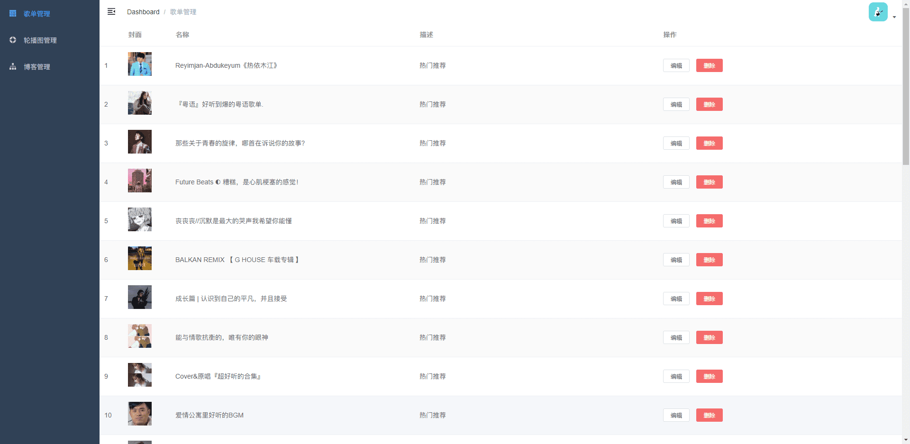
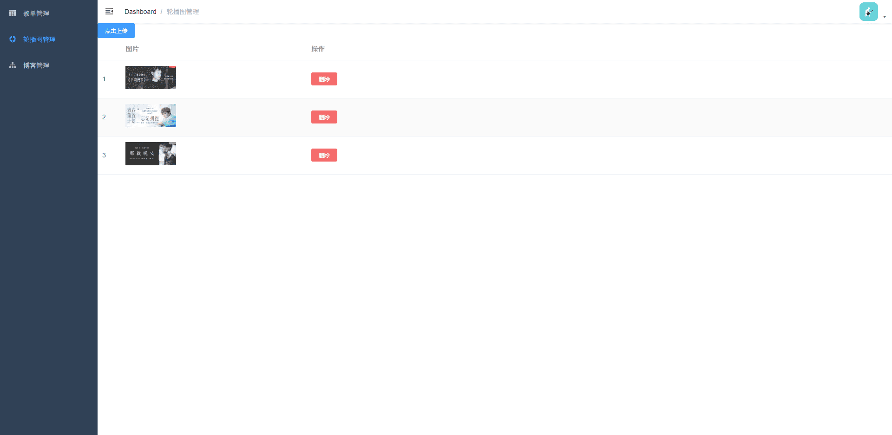
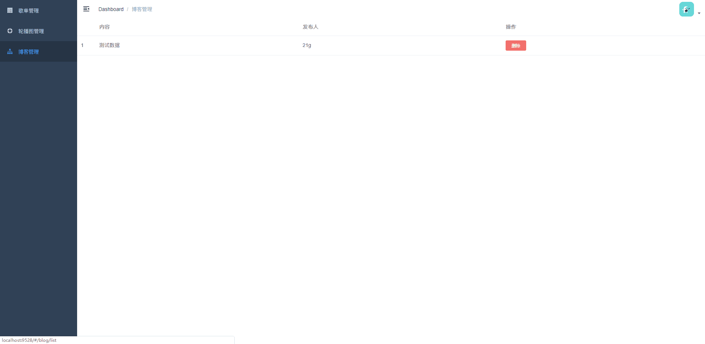

# 云音乐后台管理系统

本项目为云音乐后台管理系统，使用后台管理系统模板[vue-admin-template](./README-zh.md)。服务端使用Koa进行开发。

项目主要包括轮播图管理、歌单管理、博客管理。

## 如何运行

+ 克隆代码：`https://github.com/MiniProgramToLRH/miniprogram-ebook.git`
+ 安装依赖：`npm install`
+ 客户端运行：`npm run dev`
+ 服务端运行：`node server\app.js`

## 基础知识

+ `access_token`的获取以及缓存：[getAccessToken.js](./server/utils/getAccessToken.js)
  
  `access_token`是公众号的全局唯一接口调用凭据。access_token的存储至少要保留512个字符空间。
  
  `access_token`的有效期目前为`2个小时`，需定时刷新，重复获取将导致上次获取的access_token失效。

  公众号和小程序均可以使用AppID和AppSecret调用本接口来获取access_token。
+ 操作云数据库封装：[callCloudDB.js](./server/utils/callCloudDB.js)
+ 触发云函数封装：[callCloudFn.js](./server/utils/callCloudFn.js)\
+ 上传下载文件封装：[callCloudStorage.js](./server/utils/callCloudStorage.js)

## server/config.js 配置

``` javascript
module.exports = {
  env: 'xxx', // 云环境Id
  appid: 'xxxxxx',
  secret: 'xxxxxx'
}
```

## 项目展示




